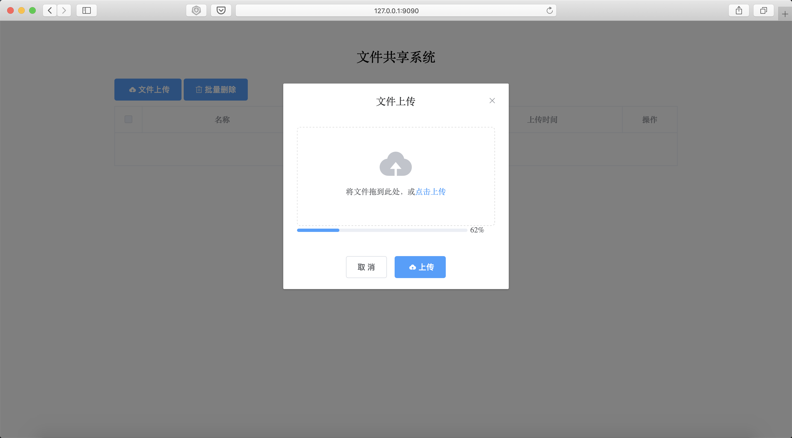
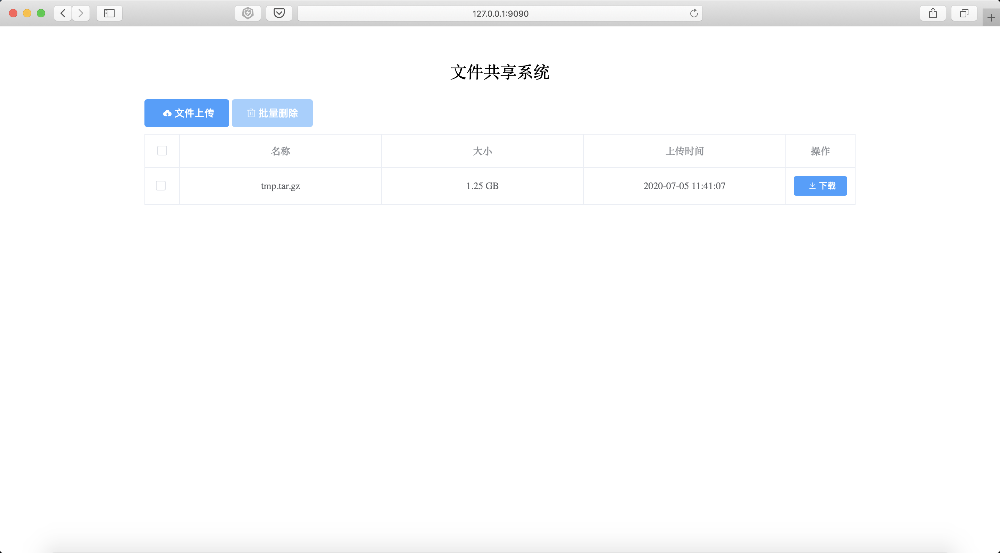

# fileserver

## 简介

文件服务器是一种轻量级、高性能的文件交换和传输工具。

它后台基于 `go + gin` , 前台基于 `vue + elementui + axios` 实现，它可以当作是一个个人文件传输共享交换工具，如果你想传输文件，但是又没有带 U盘，有了它你可以轻松搞定文件传输，可以轻松将文件分享给任何人，希望这个工具能够为大家提供便利。

## 技术选型

- go
- gin
- viper
- logrus
- vue
- elementui
- axios

## 运行

```shell
# 克隆项目
git clone https://github.com/wuchunfu/fileserver.git

# 进入项目目录
cd fileserver

# 配置环境变量
vi /etc/profile or vi ~/.bash_profile or vi ~/.zshrc
export FS_HOME=/opt/fileserver
export PATH=${FS_HOME}:${PATH}

# 使环境变量立即生效
source /etc/profile or source ~/.bash_profile or source ~/.zshrc

# 安装go依赖包
go list (go mod tidy)

# 编译
go build fileserver.go

# web 访问
http://127.0.0.1:9090
```

## 效果图





## 计划任务

- [ ] 
- [ ] 支持多平台构建并运行
- [ ] 添加构建脚本以及运行脚本
- [ ] 支持 Docker 运行
- [ ] 支持文件夹上传
- [ ] 支持文件压缩
- [ ] 支持文件夹打包下载

## 贡献指南

首先感谢你使用 `fileserver`

`FileServer` 的成长离不开大家的支持，如果你愿意为 `fileserver` 贡献代码或提供建议，请阅读以下内容。

### Issue 规范

- `issue` 仅用于提交 `Bug` 或 `Feature` 以及设计相关的内容，其它内容可能会被直接关闭。如果你在使用时产生了疑问请及时联系我。
- 在提交 `issue` 之前，请搜索相关内容是否已被提出。

### Pull Request 规范

- 请先 `fork` 一份到自己的项目下，不要直接在仓库下建分支。
- `commit` 信息要以 `[文件名]: 描述信息` 的形式填写，例如 `README.md: fix xxx bug`。
- 如果是修复 `bug` ，请在 `PR` 中给出描述信息。
- 合并代码需要两名维护人员参与：一人进行 `review` 后 `approve` ，另一人再次 `review` ，通过后即可合并。

## 联系方式


## 捐赠

如果你觉得这个项目对你有帮助，你可以请作者喝饮料


## 商用注意事项

如果您将此项目用于商业用途，请遵守 `Apache2.0` 协议并保留作者技术支持声明。

